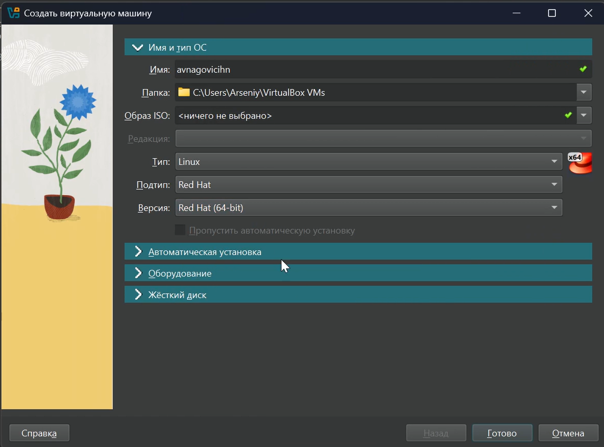
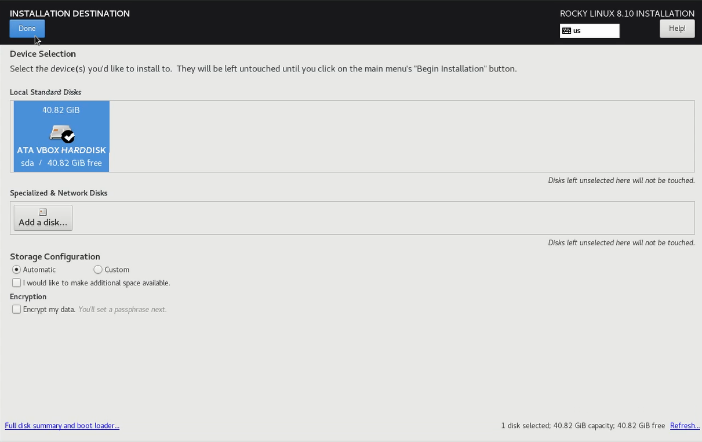

---
## Front matter
lang: ru-RU
title: Лабораторная работа 1
subtitle: Основы информационной безопасности
author:
  - Наговицын А. В.
institute:
  - Российский университет дружбы народов, Москва, Россия
date: 22.02.25

## i18n babel
babel-lang: russian
babel-otherlangs: english

## Formatting pdf
toc: false
toc-title: Содержание
slide_level: 2
aspectratio: 169
section-titles: true
theme: metropolis
header-includes:
 - \metroset{progressbar=frametitle,sectionpage=progressbar,numbering=fraction}
 - '\makeatletter'
 - '\beamer@ignorenonframefalse'
 - '\makeatother'
---

# Информация

## Докладчик

:::::::::::::: {.columns align=center}
::: {.column width="70%"}

  * Наговицын А. В.
  * Студент, 2 курс, группа НКАбд-03-23
  * Российский университет дружбы народов
  * [1132239111@pfur.ru]
  * <https://github.com/AVNagov>

:::
::: {.column width="30%"}

:::
::::::::::::::

# Вводная часть

## Цель работы

Приобретение практических навыков установки операционной системы на виртуальную машину,настройки минимально необходимых для дальнейшей работы сервисов.

## Задание

1. Настройка виртуальной машины
2. Установка Linux Rocky
3. Установка драйверов
4. Домашнее задание

# Выполнение лабораторной работы

## Настройка виртуальной машины

Создаю виртуальную машину и выбираю систему RedHat

{#fig:001 width=70%}

## Настройка виртуальной машины

Настраиваю количество ОЗУ и количество ядер процессора 

{#fig:001 width=70%}

## Настройка виртуальной машины

Создаю и настраиваю новый жесткий диск

{#fig:003 width=70%}

## Настройка виртуальной машины

Подключаю iso-образец системы Rocky 

{#fig:004 width=70%}

## Установка Linux Rocky

Выбираю в меню установки, установку системы Linux Rocky

{#fig:005 width=70%}

## Установка Linux Rocky

Выбираю в меню установки язык 

{#fig:006 width=70%}

## Установка Linux Rocky

Перехожу к настройке жесткого диска 

{#fig:007 width=70%}

## Установка Linux Rocky

Устанавливаю пароль root 

{#fig:008 width=70%}

## Установка Linux Rocky

Создаю пользователя

{#fig:009 width=70%}

## Установка Linux Rocky

Выключаю KDUMP 

{#fig:010 width=70%}

## Установка Linux Rocky

Включаю инструменты разработки для установки Linux Rocky 

{#fig:011 width=70%}

## Установка Linux Rocky

Включаю свою сеть

{#fig:012 width=70%}

## Установка Linux Rocky

Установка завершена 

{#fig:013 width=70%}

## Установка Linux Rocky

Принимаю лицензионное соглашение 

{#fig:014 width=70%}

## Установка драйверов

Нажимаю устройства->Подключить образ Дополнений гостевой ОС

{#fig:015 width=70%}

## Домашнее задание

Ввожу команду dmesg | less

{#fig:016 width=70%}

## Домашнее задание

Ввожу команду dmesg

{#fig:017 width=70%}

# Ответы на контрольные вопросы

1. Учетная запись содержит необходимые для идентификации пользователя при подключении к системе данные, а так же информацию для авторизации и учета: системного имени (user name) (оно может содержать только латинские буквы и знак нижнее подчеркивание, еще оно должно быть уникальным), идентификатор пользователя (UID) (уникальный идентификатор пользователя в системе, целое положительное число), идентификатор группы (CID) (группа, к к-рой относится пользователь. Она, как минимум, одна, по умолчанию - одна), полное имя (full name) (Могут быть ФИО), домашний каталог (home directory) (каталог, в к-рый попадает пользователь после входа в систему и в к-ром хранятся его данные), начальная оболочка (login shell) (командная оболочка, к-рая запускается при входе в систему).

# Ответы на контрольные вопросы

2. Для получения справки по команде: <команда> —help; для перемещения по файловой системе - cd; для просмотра содержимого каталога - ls; для определения объёма каталога - du <имя каталога>; для создания / удаления каталогов - mkdir/rmdir; для создания / удаления файлов - touch/rm; для задания определённых прав на файл / каталог - chmod; для просмотра истории команд - history

# Ответы на контрольные вопросы

3. Файловая система - это порядок, определяющий способ организации и хранения и именования данных на различных носителях информации. Примеры: FAT32 представляет собой пространство, разделенное на три части: олна область для служебных структур, форма указателей в виде таблиц и зона для хранения самих файлов. ext3/ext4 - журналируемая файловая система, используемая в основном в ОС с ядром Linux.

# Ответы на контрольные вопросы

4. С помощью команды df, введя ее в терминале. Это утилита, которая показывает список всех файловых систем по именам устройств, сообщает их размер и данные о памяти. Также посмотреть подмонтированные файловые системы можно с помощью утилиты mount.

# Ответы на контрольные вопросы

5. Чтобы удалить зависший процесс, вначале мы должны узнать, какой у него id: используем команду ps. Далее в терминале вводим команду kill < id процесса >. Или можно использовать утилиту killall, что "убьет" все процессы, которые есть в данный момент, для этого не нужно знать id процесса. 

# Выводы

Я приобрел практические навыки установки операционной системы на виртуальную машину, настройки минимально необходимых для дальнейшей работы сервисов.

