---
## Front matter
lang: ru-RU
title: Лабораторная работа 1
subtitle: Основы информационной безопасности
author:
  - Наговицын А. В.
institute:
  - Российский университет дружбы народов, Москва, Россия
date: 22.02.25

## i18n babel
babel-lang: russian
babel-otherlangs: english

## Formatting pdf
toc: false
toc-title: Содержание
slide_level: 2
aspectratio: 169
section-titles: true
theme: metropolis
header-includes:
 - \metroset{progressbar=frametitle,sectionpage=progressbar,numbering=fraction}
 - '\makeatletter'
 - '\beamer@ignorenonframefalse'
 - '\makeatother'
---

# Информация

## Докладчик

:::::::::::::: {.columns align=center}
::: {.column width="70%"}

  * Наговицын А. В.
  * Студент, 2 курс, группа НКАбд-03-23
  * Российский университет дружбы народов
  * [1132239111@pfur.ru]
  * <https://github.com/AVNagov>

:::
::: {.column width="30%"}

:::
::::::::::::::

# Вводная часть

## Цель работы

Получение практических навыков работы в консоли с атрибутами файлов, закрепление теоретических основ дискреционного разграничения доступа в современных системах с открытым кодом на базе ОС Linux

## Задание

1. Работа с атрибутами файлов
2. Заполнение таблиц

# Выполнение лабораторной работы

## Работа с атрибутами файлов

Создаю нового пользователя и создаю ему сразу пароль (рис. @fig:001).

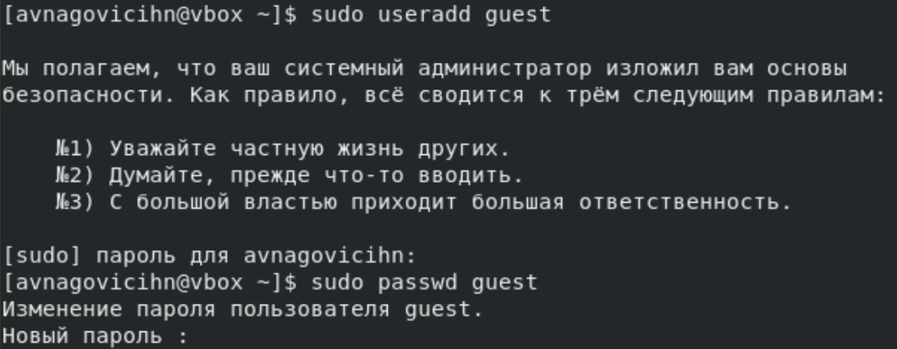{#fig:001 width=70%}

## Работа с атрибутами файлов

Меняю пользователя системы (рис. @fig:002).

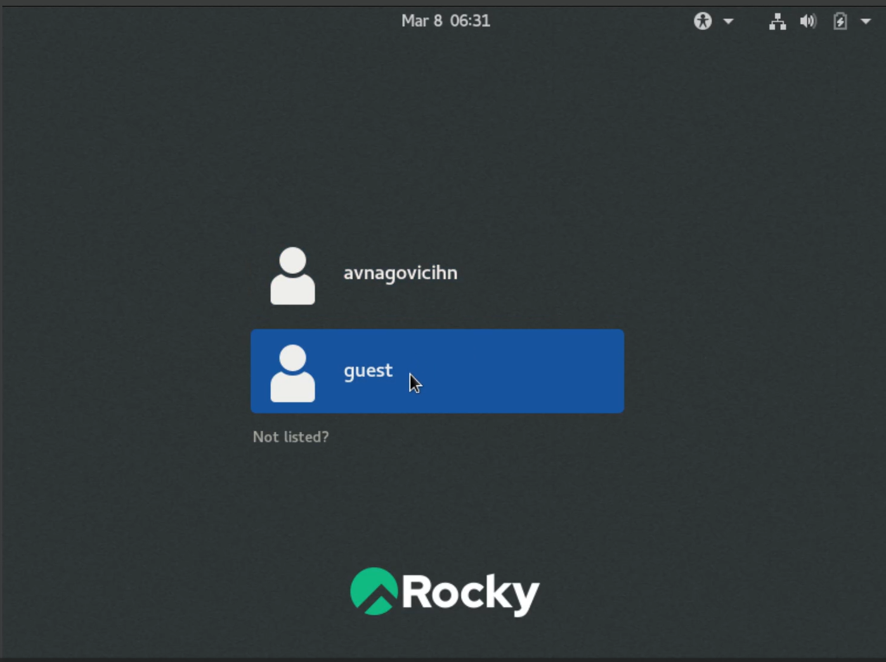{#fig:002 width=70%}

## Работа с атрибутами файлов

Проверяю что нахожусь в директории /home/guest (рис. @fig:003).

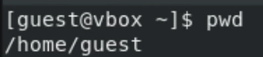{#fig:003 width=70%}

## Работа с атрибутами файлов

Уточняю имя пользователя (рис. @fig:004).

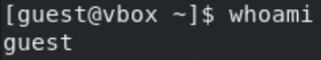{#fig:004 width=70%}

## Работа с атрибутами файлов

Уточняю id (рис. @fig:005).

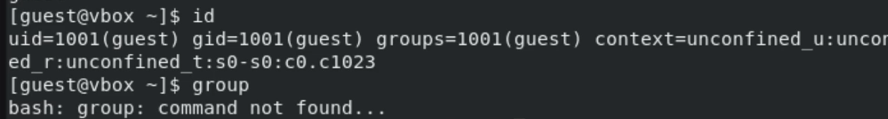{#fig:005 width=70%}

## Работа с атрибутами файлов

Уточняю группу пользователя (рис. @fig:006).

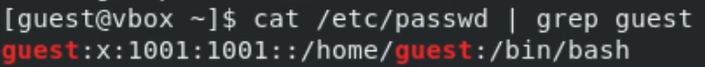{#fig:006 width=70%}

## Работа с атрибутами файлов

Уточняю информацию о пользователе в файле passwd (рис. @fig:007).

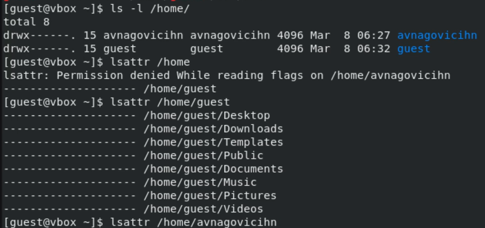{#fig:007 width=70%}

## Работа с атрибутами файлов

Отображаю список директорий и проверяю аттрибуты директорий. (рис. @fig:008).

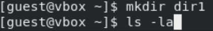{#fig:008 width=70%}

## Работа с атрибутами файлов

Проверяю атрибуты директории dir1 и получаю ошибку, после чего изменяю права и снова проверяю (рис. @fig:009).

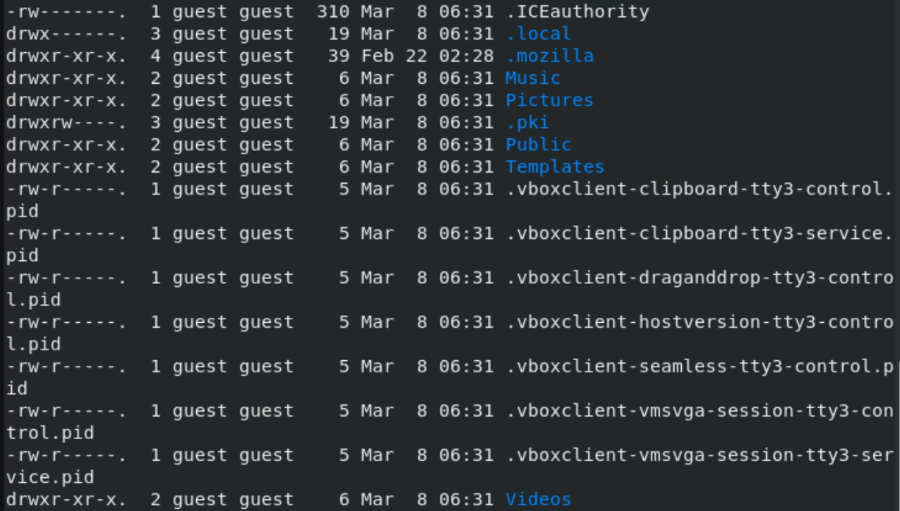{#fig:009 width=70%}

## Работа с атрибутами файлов

Вывод команды (рис. @fig:010).

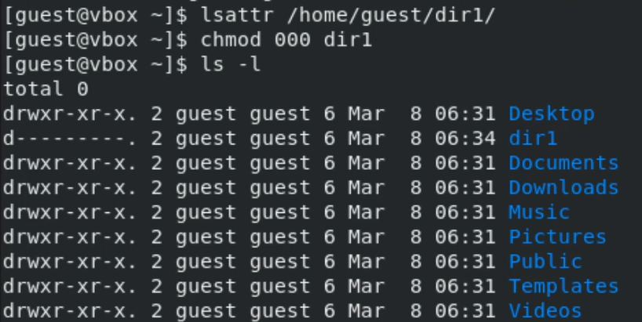{#fig:010 width=70%}

## Работа с атрибутами файлов

Определяю права доступа и атрибуты выставленные на dir1 (рис. @fig:011).

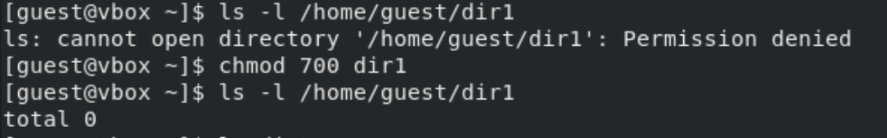{#fig:011 width=70%}

## Заполнение таблиц

| | | | | | | | | | |
|-|-|-|-|-|-|-|-|-|-|
|Права директории|Права  файла|Создание  файла|Удаление  файла|Запись  в файл|Чтение  файла|Смена  директории|Просмотр файлов в  директории|Переимено- вание файла|Смена  атрибутов  файла|
|d(000)|(000)| -| -| -| -| -| -| -| -|
|d(000)|(100)| -| -| -| -| -| -| -| -|
|d(000)|(200)| -| -| -| -| -| -| -| -|
|d(000)|(300)| -| -| -| -| -| -| -| -|
|d(000)|(400)| -| -| -| -| -| -| -| -|
|d(000)|(500)| -| -| -| -| -| -| -| -|
|d(000)|(600)| -| -| -| -| -| -| -| -|
|d(000)|(700)| -| -| -| -| -| -| -| -|
|d(100)|(000)| -| -| -| -|+| -| -|+|
|d(100)|(100)| -| -| -| -|+| -| -|+|
|d(100)|(200)| -| -|+| -|+| -| -|+|
|d(100)|(300)| -| -|+| -|+| -| -|+|
|d(100)|(400)| -| -|-|+|+| -| -|+|
|d(100)|(500)| -| -|-|+|+| -| -|+|
|d(100)|(600)| -| -|+|+|+| -| -|+|
|d(100)|(700)| -| -|+|+|+| -| -|+|
|d(200)|(000)| -| -|-|-|-| -| -|-|
|d(200)|(100)| -| -|-|-|-| -| -|-|
|d(200)|(200)| -| -|-|-|-| -| -|-|
|d(200)|(300)| -| -|-|-|-| -| -|-|
|d(200)|(400)| -| -|-|-|-| -| -|-|
|d(200)|(500)| -| -|-|-|-| -| -|-|
|d(200)|(600)| -| -|-|-|-| -| -|-|
|d(200)|(700)| -| -|-|-|-| -| -|-|
|d(300)|(000)|+|+|-|-|+| -|+|+|
|d(300)|(100)|+|+|-|-|+| -|+|+|
|d(300)|(200)|+|+|+|-|+| -|+|+|
|d(300)|(300)|+|+|+|-|+| -|+|+|
|d(300)|(400)|+|+|-|+|+| -|+|+|
|d(300)|(500)|+|+|-|+|+| -|+|+|
|d(300)|(600)|+|+|+|+|+| -|+|+|
|d(300)|(700)|+|+|+|+|+| -|+|+|
|d(400)|(000)|-|-|-|-|-|+|-|-|
|d(400)|(100)|-|-|-|-|-|+|-|-|
|d(400)|(200)|-|-|-|-|-|+|-|-|
|d(400)|(300)|-|-|-|-|-|+|-|-|
|d(400)|(400)|-|-|-|-|-|+|-|-|
|d(400)|(500)|-|-|-|-|-|+|-|-|
|d(400)|(600)|-|-|-|-|-|+|-|-|
|d(400)|(700)|-|-|-|-|-|+|-|-|
|d(500)|(000)|-|-|-|-|+|+|-|+|
|d(500)|(100)|-|-|-|-|+|+|-|+|
|d(500)|(200)|-|-|+|-|+|+|-|+|
|d(500)|(300)|-|-|+|-|+|+|-|+|
|d(500)|(400)|-|-|-|+|+|+|-|+|
|d(500)|(500)|-|-|-|+|+|+|-|+|
|d(500)|(600)|-|-|+|+|+|+|-|+|
|d(500)|(700)|-|-|+|+|+|+|-|+|
|d(600)|(000)|-|-|-|-|-|+|-|-|
|d(600)|(100)|-|-|-|-|-|+|-|-|
|d(600)|(200)|-|-|-|-|-|+|-|-|
|d(600)|(300)|-|-|-|-|-|+|-|-|
|d(600)|(400)|-|-|-|-|-|+|-|-|
|d(600)|(500)|-|-|-|-|-|+|-|-|
|d(600)|(600)|-|-|-|-|-|+|-|-|
|d(600)|(700)|-|-|-|-|-|+|-|-|
|d(700)|(000)|+|+|-|-|+|+|+|+|
|d(700)|(100)|+|+|-|-|+|+|+|+|
|d(700)|(200)|+|+|+|-|+|+|+|+|
|d(700)|(300)|+|+|+|-|+|+|+|+|
|d(700)|(400)|+|+|-|+|+|+|+|+|
|d(700)|(500)|+|+|-|+|+|+|+|+|
|d(700)|(600)|+|+|+|+|+|+|+|+|
|d(700)|(700)|+|+|+|+|+|+|+|+|

Таблица 2.1 «Установленные права и разрешённые действия»

## Заполнение таблиц

| | | | | |
|-|-|-|-|-|
|Операция| |Минимальные  права на  директорию| |Минимальные  права на файл|
|Создание файла| |d(300)| |-|
|Удаление файла| |d(300)| |-|
|Чтение файла| |d(100)| |(400)|
|Запись в файл| |d(100)| |(200)|
|Переименование файла| |d(300)| |(000)|
|Создание поддиректории| |d(300)| |-|
|Удаление поддиректории| |d(300)| |-|

Таблица 2.2 "Минимальные права для совершения операций"

# Выводы

В этой лабароторной работе были получены практические навыки работы в консоли с атрибутами файлов, закреплены теоретические основы дискреционного разграничения доступа в современных системах с открытым кодом на базе ОС Linux.