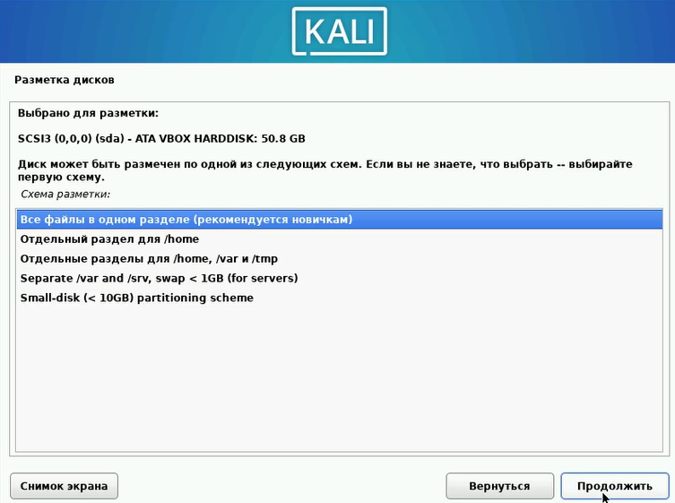

---
## Front matter
lang: ru-RU
title: 1 Этап Индивидуального проекта
subtitle: Основы информационной безопасности
author:
  - Наговицын А. В.
institute:
  - Российский университет дружбы народов, Москва, Россия
date: 22.02.25

## i18n babel
babel-lang: russian
babel-otherlangs: english

## Formatting pdf
toc: false
toc-title: Содержание
slide_level: 2
aspectratio: 169
section-titles: true
theme: metropolis
header-includes:
 - \metroset{progressbar=frametitle,sectionpage=progressbar,numbering=fraction}
 - '\makeatletter'
 - '\beamer@ignorenonframefalse'
 - '\makeatother'
---

# Информация

## Докладчик

:::::::::::::: {.columns align=center}
::: {.column width="70%"}

  * Наговицын А. В.
  * Студент, 2 курс, группа НКАбд-03-23
  * Российский университет дружбы народов
  * [1132239111@pfur.ru]
  * <https://github.com/AVNagov>

:::
::: {.column width="30%"}

:::
::::::::::::::

## Задание

1. Создание и настройка виртуальной машины

2. Установка Kali linux

# Выполнение лабораторной работы

## Создание и настройка виртуальной машины

Создаю новую виртуальную машину (рис. @fig:001).

{#fig:001 width=70%}

## Создание и настройка виртуальной машины

Выделяю 10 ядер процессора (рис. @fig:002).

{#fig:002 width=70%}

## Создание и настройка виртуальной машины

Создаю новый виртуальный жесткий диск (рис. @fig:003).

{#fig:003 width=70%}

## Установка Kali linux

Выбираю язык, на котором будет система Kali Linux (рис. @fig:004).

{#fig:004 width=70%}

## Установка Kali linux

Создаю пользователя (рис. @fig:005).

{#fig:005 width=70%}

## Установка Kali linux

Создаю пароль для пользователя (рис. @fig:006).

{#fig:006 width=70%}

## Установка Kali linux

Настраиваю разметку диска (рис. @fig:007).

{#fig:007 width=70%}

## Установка Kali linux

Настройка разметки дисков (рис. @fig:008).

{#fig:008 width=70%}

## Установка Kali linux

Установка GRUB (рис. @fig:009).

{#fig:009 width=70%}

## Установка Kali linux

Завершение установки (рис. @fig:008).

{#fig:008 width=70%}

# Выводы

В этом этапе проекта, я получил практические навыки в установке системы Kali Linux.